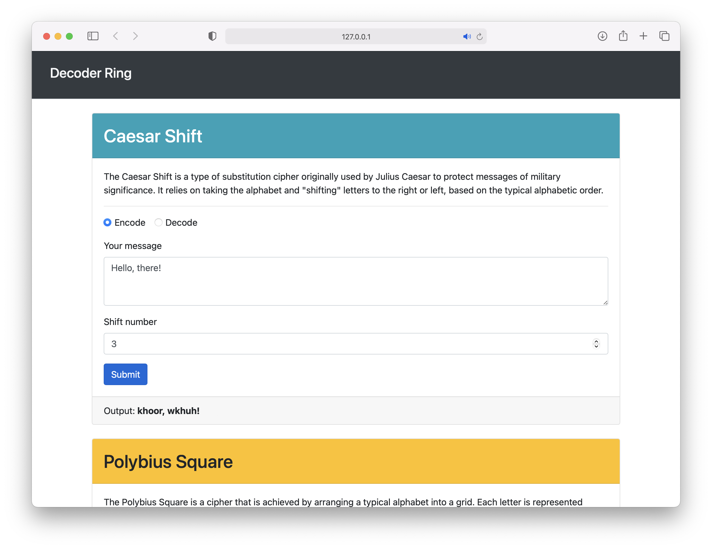

# Decoder Ring Project

## About This Project
This is a project from the Thinkful Software Engineering course, which focuses on algorithms created by the student. It also asked students to use [Mocha](https://mochajs.org) and [Chai](https://www.chaijs.com) to create and run custom tests on the code to confirm it worked correctly. 

## Installation
If you are interested in running this project on your own computer:  
1. You will need [Node JS](https://nodejs.org/en/) installed. 
2. Download the files in this repository.
3. Open Terminal or Windows Powershell (If Windows, open with Admin Privileges)
4. Type `cd`, followed by the filepath to your downloaded folder, and hit ENTER. (Example: `cd ~/Desktop/Decoder-Ring-Thinkful`)
5. Enter `npm install`
6. Enter `npm start`
7. The application will open in your default web browser. 

## Requirements
You can find the full list of instructions and qualifications for this project [here](https://docs.google.com/document/d/1Kp5WkfRD2n9Eej8GMjyRgacJB1NQTraIvxRP8Uzq0wg/edit?usp=sharing)